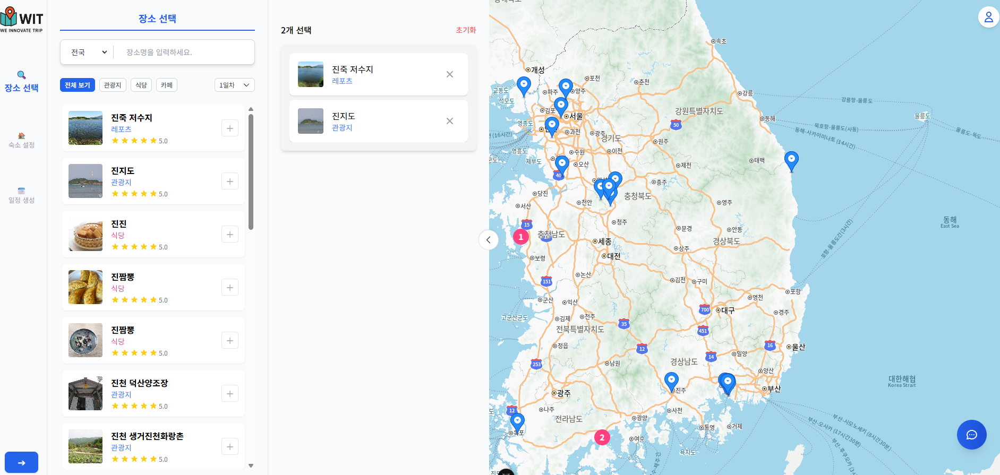

# ✨ WIT: We Innovate Trip

국내 여행을 스마트하게 계획하고, 최적의 동선을 자동으로 추천해주는 여행 일정 관리 웹 서비스입니다.

> “여행도 효율적으로! 일정 추천, 최적 동선, AI 챗봇까지 한 번에.”

---

[홈페이지 링크] : https://web-vue-mbhk6pks03b248b5.sel4.cloudtype.app/

## 🔍 프로젝트 개요

**WIT (We Innovate Trip)**은 여행자가 **직접 명소, 숙소, 음식점을 선택**하면  
자동으로 **최적의 이동 경로 및 시간 기반 타임테이블**을 생성하여  
여행 계획을 간편하게 저장, 공유, 수정할 수 있도록 지원하는 웹 애플리케이션입니다.

---

## 🛠️ 사용 기술

### Backend
- Java 17
- Spring Boot 3
- MyBatis
- MySQL 8
- JWT 인증
- Selenium (데이터 수집 자동화)

### Frontend
- Vue 3 (Vite)
- Tailwind CSS
- Axios
- Pinia (상태 관리)

### 기타
- Kakao Map API (위치 검색, 리뷰, 이미지)
- 한국관광공사 TourAPI (명소 데이터)
- Git / GitHub

---

## 📦 주요 기능

| 기능 | 설명 |
|------|------|
| 🔍 여행지 검색 | 지역/카테고리 기반 명소, 음식점, 숙소 탐색 |
| 📝 일정 생성 | 원하는 장소 선택 → 자동 최적경로 계산 (TSP 알고리즘 적용) |
| 📅 타임테이블 생성 | 장소별 체류시간 + 이동시간 기반 일정표 생성 |
| 💬 AI 챗봇 | MBTI, 지역, 여행일 수 기반 맞춤 일정 추천 |
| 🧾 마이페이지 | 저장된 일정 확인, 수정, 삭제 |
| ⭐ 리뷰 정보 | Kakao Map 기반 평점 및 리뷰 개수 표시 |
| 🛏️ 숙소 선택 | 일정별 시작/종료 숙소 설정 기능 |

---

